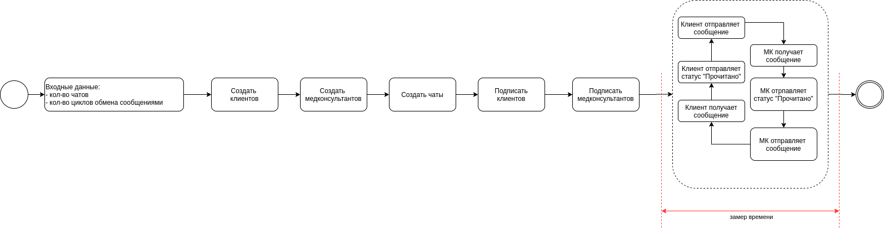

## Нагрузочное тестирование функционала чата 

**Исследуемый функционал:** тестовый чат (обмен сообщениями между клиентом и медконсультантом). 

**Цель:** проверить соответствие функционала заявленным требованиям (пропускная способность **130 сообщений / секунду**) 

#### Ограничения  

* не включены в исследование следующие этапы процесса, связанные с функционалом чата и непосредственно влияющие на его производительность при реальном использовании системы 

    * создание новой медконсультации (в системе создается при отправке первого сообщения в чат клиентом) 

    * алгоритм поиска доступного медконсультанта 

    * отправка специфичных сообщений (карточки клиника, карточка врача) 

    * отправка файлов  

#### Методика 

##### Модель тестовой нагрузки 

Java-приложение моделирует одновременный обмен сообщениями между клиентами и медконсультантами по следующим правилам: 

* Моделируется параллельный обмен сообщениями в N чатах. Для каждого отправителя / получателя создаются отдельные потоки (thread), в которых происходит отправка, получение, изменение статуса сообщений 

* Моделируется реальная работа системы за счет создания циклов обмена сообщениями внутри одного чата с указанной размерностью и временной задержкой между сообщениями. Под циклом обмена сообщениями понимается процесс последовательной отправки, получения и изменения статуса «Прочитано» между пользователями 

* В качестве входных параметров задаются: 

    * Кол-во параллельно обслуживаемых чатов 
    
    * Кол-во циклов сообщений в каждом чате 
    
    * Временная задержка между сообщениями в одном цикле 

* Для каждого чата создаются новые пользователи (клиент, медконсультант) 

##### Измеряемые параметры: 

* Измерения происходят на стороне клиента 

* Фиксируется момент времени отправки сообщения в веб-сокет и момент времени получения сообщения оппонентом. Разница между данными моментами считается временем прохождения сообщения. 

* Фиксируется момент времени отправки первого сообщения и момент времени получения последнего сообщения, таким образом получаем время обмена сообщениями и рассчитываем пропускную способность 

* Для каждого сообщения фиксируется факт отправки, получения и изменения статуса на Прочитано, таким образом фиксируется кол-во потерянных сообщений (отправленных, но не принятых)  

* Временные характеристики потерянных сообщений не учитываются, что приводит к некоторому искажению результата для сценариев, где часть сообщений потеряна 



#### Запуск

* Необходимо сбилдить сервис

````
./gradlew build
````

* Для запуска тестов необходимы запущенные и доступные сервисы системы: ``mysql``, ``redis``, ``nats``, ``users``, ``chats``

* Скопировать файл ``.env.example`` в ``.env`` и указать корректные значения переменных

* Заполнить параметры тестовых бенчмарков в файле ``./benchmarks/benchmarks.json``

##### Запуск через docker-compose

````
docker-compose up 
````

##### Запуск через CLI

````
java -jar ./build/lib/chat-loading-test-1.0.0
````

##### Просмотров логов и результатов

Логи выполнения можно посмотреть в файле ``./log/debug.log``

Результаты работы тестов выводятся в файл ``./log/report.log``

 

 

 